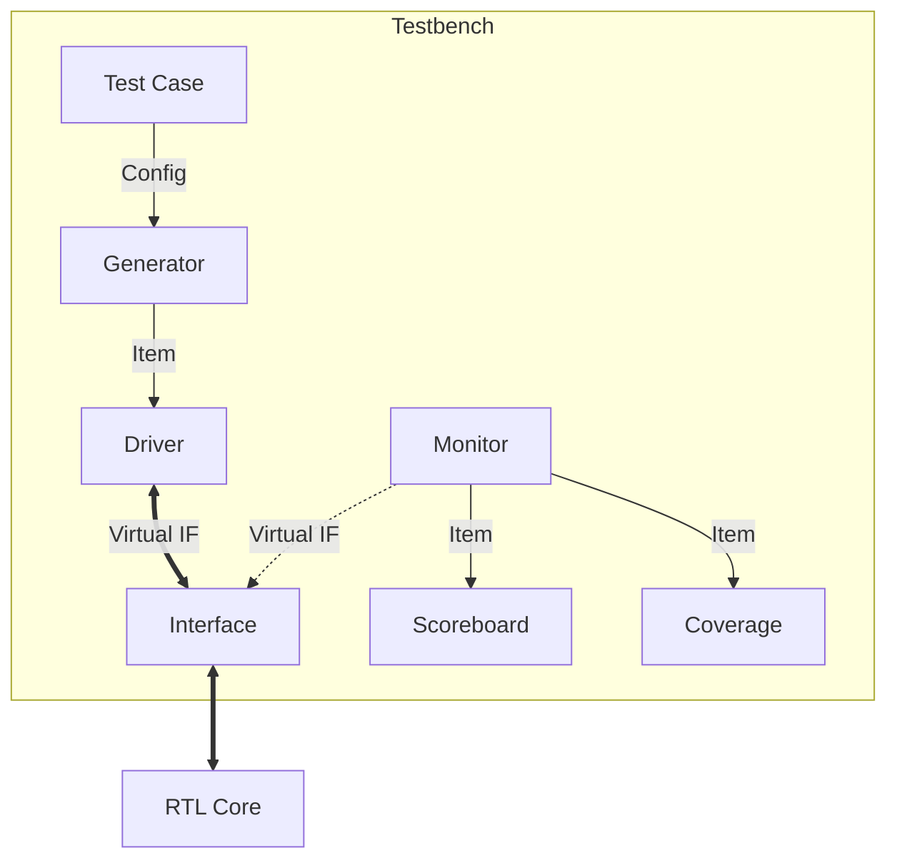

# Cấu Trúc File & Mối Quan Hệ Giữa Các Thành Phần

## 1. Bảng Tổng Hợp Chức Năng Các File Code

Dưới đây là danh sách các file mã nguồn tạo nên môi trường testbench (`tb/`), được phân nhóm theo thư mục chức năng.

| Thư Mục | Tên File | Chức Năng / Nhiệm Vụ |
| :--- | :--- | :--- |
| **`tb/include`** | `apb_defines.sv` | Định nghĩa các hằng số (Địa chỉ Register, Bit mask) dùng chung cho toàn bộ dự án. |
| | `transaction.sv` | Định nghĩa lớp đối tượng: `apb_transaction` (gói tin APB) và `uart_transaction` (gói tin Serial). |
| | `apb_if.sv` | Interface định nghĩa các tín hiệu bus APB (PCLK, PSEL, PADDR, PWDATA...). |
| | `uart_if.sv` | Interface định nghĩa các tín hiệu Serial UART (TX, RX, CTS, RTS). |
| **`tb/apb_agent`** | `apb_generator.sv` | Sinh tạo và đẩy các `apb_transaction` ngẫu nhiên xuống Driver. |
| | `apb_driver.sv` | Nhận transaction từ Generator, lái tín hiệu lên Interface APB theo đúng chuẩn timing. |
| | `apb_monitor.sv` | Quan sát Bus APB thụ động, bắt các gói tin Write/Read và gửi về Scoreboard/Coverage. |
| **`tb/uart_agent`** | `uart_driver.sv` | Giả lập phía thiết bị ngoại vi, lái tín hiệu vào chân RX DUT (bao gồm inject lỗi). |
| | `uart_monitor.sv` | Quan sát chân TX/RX, chuyển đổi tín hiệu bit nối tiếp thành gói tin byte để kiểm tra. |
| **`tb/env`** | `scoreboard.sv` | Bảng điểm: Nhận gói tin từ 2 Monitor, so sánh (Compare) và báo PASS/FAIL. |
| | `coverage.sv` | Thu thập dữ liệu coverage (Functional & FSM) để đánh giá chất lượng test. |
| | `environment.sv` | "Container" chứa và kết nối tất cả các thành phần trên (Agents, Scoreboard, Coverage). |
| **`tb/test`** | `base_test.sv` | Lớp cha của mọi test case, chứa logic khởi tạo Environment và setup Interface. |
| | `test_*.sv` | Các kịch bản test cụ thể (Sanity, TX, RX, FIFO, Error...) kế thừa từ `base_test`. |
| **`tb/`** | `tb_top.sv` | Module Top-Level, kết nối DUT (RTL) với Interfaces và chạy Test. |

---

## 2. Cách Các File Kết Nối & Hoạt Động Cùng Nhau

Hệ thống hoạt động như một cỗ máy lắp ráp với các đường dây băng tải (Mailbox) và chốt cắm (Interface).

### Bước 1: Kết Nối Cứng (Hardware Connection) - Tại `tb_top.sv`
*   **Interfaces (`apb_if`, `uart_if`)**: Được khai báo như những bó tín hiệu.
*   **DUT (RTL)**: Được cắm vào các Interfaces này.
*   **Test**: Được khởi chạy trong `initial block`, nhận các Interfaces này thông qua "Virtual Interface".

### Bước 2: Khởi Tạo & Kết Nối Mềm (Environment Build) - Tại `environment.sv`
Khi `test_*.sv` chạy, nó gọi `env.build()`:
*   **Agents** (APB, UART) được tạo ra.
*   **Mailbox** (Hòm thư) được tạo ra để các khối giao tiếp với nhau.
*   **Kết nối**:
    *   `Generator` --[Mailbox]--> `Driver` (Gửi lệnh điều khiển).
    *   `Monitor` --[Mailbox]--> `Scoreboard` (Gửi báo cáo kết quả).
    *   `Monitor` --[Mailbox]--> `Coverage` (Gửi dữ liệu thống kê).

### Bước 3: Luồng Chạy (Execution Flow)
1.  **`test_*.sv`**: Điều phối viên. Nó cấu hình `Generator` (ví dụ: Kiểu đạo diễn ra lệnh cho diễn viên).
2.  **`apb_generator.sv`**: Tạo gói tin -> Bỏ vào mailbox.
3.  **`apb_driver.sv`**: Lấy gói tin từ mailbox -> Điều khiển chân tín hiệu trên `apb_if` giật lên giật xuống (Signal Wiggle).
4.  **DUT**: Thấy tín hiệu, làm việc, và phản hồi ra chân TX hoặc bus APB.
5.  **`monitor.sv`**: Thấy chân tín hiệu thay đổi -> Gom lại thành gói tin -> Bỏ vào mailbox báo cáo.
6.  **`scoreboard.sv`**: Mở mailbox báo cáo, so sánh với đáp án (Golden Model) -> In ra "MATCH" hoặc "MISMATCH".

### Sơ Đồ Logic Kết Nối

