# Kiến trúc Môi trường Testbench APB-UART

Tài liệu này mô tả chi tiết kiến trúc và luồng hoạt động của môi trường xác minh (Verification Environment) cho module APB-UART. Môi trường được xây dựng bằng SystemVerilog theo phong cách hướng đối tượng (OOP), mô phỏng cấu trúc phân tầng của UVM.

## 1. Tổng quan Hệ thống (System Overview)

Sơ đồ kết nối tổng quát:

```mermaid
flowchart TD
    %% Global Styles
    classDef box fill:#2d2d2d,stroke:#ccc,stroke-width:2px;
    classDef agent fill:#1a3a3a,stroke:#00ced1,stroke-width:2px;

    %% Test Layer
    subgraph Test_Layer ["Lớp Test"]
        direction TB
        Test["Test Case"]
        Env["Environment"]
        Test -->|creates| Env
    end

    %% Environment Layer
    subgraph Env_Layer ["Lớp Môi Trường"]
        direction TB
        
        subgraph APB_Agent ["APB Agent (Active)"]
            Gen["Generator"]
            Drv_APB["APB Driver"]
            Mon_APB["APB Monitor"]
            Gen -->|Mailbox| Drv_APB
        end

        subgraph UART_Agent ["UART Agent"]
            Drv_UART["UART Driver"]
            Mon_UART["UART Monitor"]
        end

        Scb["Scoreboard"]
        Cov["Coverage"]

        %% Connections inside Env
        Env --- APB_Agent
        Env --- UART_Agent
        Env --- Scb
        Env --- Cov

        %% Monitoring paths
        Mon_APB -->|Mailbox| Scb
        Mon_APB -->|Mailbox| Cov
        Mon_UART -->|Mailbox| Scb
    end

    %% RTL Layer
    subgraph RTL_Layer ["Lớp RTL / Hardware"]
        direction LR
        IF_APB[["APB Interface"]]
        IF_UART[["UART Interface"]]
        DUT[("UART Core (DUT)")]
        
        IF_APB <--> DUT
        IF_UART <--> DUT
    end

    %% Interface Connections
    Drv_APB <==>|Virtual IF| IF_APB
    Mon_APB -.-> IF_APB
    
    Drv_UART <==>|Virtual IF| IF_UART
    Mon_UART -.-> IF_UART

    %% Apply Classes
    class Test_Layer,Env_Layer,RTL_Layer box
    class APB_Agent,UART_Agent agent
```

## 2. Chi tiết các Thành phần (Components)

### 2.1. Lớp Test (Test Layer)
*   **`base_test`**: Class cha, chịu trách nhiệm khởi tạo `environment`, cấu hình chung và quản lý timeout.
*   **`test_sanity`, `test_tx`, v.v.**: Các test case cụ thể mở rộng từ `base_test`.

### 2.2. APB Agent (Phía CPU)
*   **`apb_generator`**: Sinh tạo các transaction ngẫu nhiên (Write/Read) dựa trên ràng buộc.
*   **`apb_driver`**: Lái tín hiệu APB (PSEL, PENABLE...) vào DUT.
*   **`apb_monitor`**: Giám sát bus APB thụ động, thu thập dữ liệu gửi tới Scoreboard.

### 2.3. UART Agent (Phía Serial)
*   **`uart_driver`**: Lái dữ liệu nối tiếp vào chân RX của DUT.
*   **`uart_monitor`**: Giám sát chân TX/RX, bóc tách bit thành byte để kiểm tra.

### 2.4. Scoreboard (Bảng điểm)
*   So sánh dữ liệu mong đợi và dữ liệu thực tế để báo PASS/FAIL.

## 3. Luồng Dữ Liệu và Kiểm Tra (Data Flow & Verification)

Hệ thống sử dụng cơ chế kiểm tra chéo (cross-check) dựa trên hai Monitor:

### 3.1. Kiểm Tra Đường Truyền TX (CPU Gửi -> DUT Phát)
*   CPU ghi vào **TXDATA** -> `apb_monitor` bắt và gửi dữ liệu tới Scoreboard làm "dữ liệu mong đợi".
*   DUT phát ra **chân TX** -> `uart_monitor` bắt và gửi tới Scoreboard làm "dữ liệu thực tế".
*   Scoreboard so sánh và báo kết quả.

### 3.2. Kiểm Tra Đường Truyền RX (Ngoại Vi Gửi -> DUT Nhận)
*   Ngoại vi lái **chân RX** -> `uart_monitor` bắt và gửi tới Scoreboard làm "dữ liệu mong đợi".
*   CPU thực hiện lệnh ĐỌC **RXDATA** -> `apb_monitor` bắt giá trị trả về và gửi tới Scoreboard.
*   Scoreboard so sánh giá trị đọc được với giá trị ngoại vi đã gửi.
